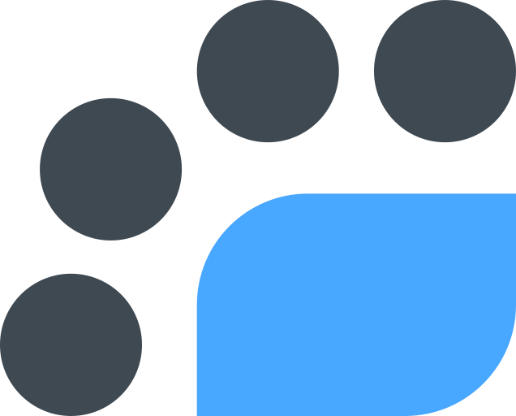

#  Lightscale

A self-hosted wireguard VPN gateway with lightweight access control and completely vanilla client-side connection. From the naming, it may be obvious what this is meant as an alternative to. `lightscale` manages it over a unix socket, following the Docker pattern (other stuff might do this too, I'm just familiar with Docker doing it).

## Basic Install

Prerequisites: Git, Go 1.26+, sudo
```sh
sudo apt install git golang-go
```

This will get the current source, compile it, and put the binaries in the correct places.
```sh
curl -fsSL https://raw.githubusercontent.com/devcutler/lightscale/main/deploy/install.sh | bash
```

> [!NOTE]
> If installing manually:
> ```sh
> # writes /etc/lightscale/lightscale.toml
> sudo lightscaled init
> ```

```sh
# set whatever you need in your default editor
sudo $EDITOR /etc/lightscale/lightscale.toml

# run in the foreground
sudo lightscaled
```

I don't recommend running in Docker for various reasons, but you can for cleanliness if you absolutely want to. There's an example compose file and the Dockerfile (for building automatically) in `deploy/`. For docker the services you want clients to reach have to be on a network accessible to the container. You can just add it to a shared network with all your services (or use host networking).

You could probably run this fairly easily with any other process-management tool like PM2. I can't imagine it'd be difficult to manage this with something like Podman too.

## Commands

- `user`, `user-group`, `service`, `service-group`: create / list / get / update / delete, plus `join` / `leave` on the groups.
- `policy`: `add <subject> <object> allow|deny`, `list`, `delete <id>`.
- `status`, `peers`, `connections`, `dns`: inspect the daemon and tunnel.
- `serve <bind>`: serve the web UI (see [Web UI](#web-ui)).

Run any command with `--help` for its flags. `--json` for machine output on most commands, `--socket <path>` to point at a non-default socket.

## Config

Precedence: `--config <path>` > `LIGHTSCALE_CONFIG` > `/etc/lightscale/lightscale.toml`. The only field you have to set is `public_endpoint` (host:port). The rest have working defaults.

## Adding someone

```sh
lightscale user create alice --email alice@example.com

# will output the full unredacted (with keys) config
lightscale user config alice

# or directly to a file
lightscale user config alice > alice.conf
```

`alice.conf` works in any wireguard client (or `wg-quick up ./alice.conf`). It's just a vanilla wireguard config. Alice will import the config and try to connect to whatever you set `public_endpoint` to.

## Exposing a service

By default, `origin` will be host.

```sh
# host         a port on 127.0.0.1 from lightscale's perspective
# <container>  a docker container, by name, if the docker socket is set in the config
# <ip>         any accessible IP from lightscale's perspective
# <hostname>   simple DNS resolution
lightscale service create jellyfin --origin host --ports 8096/tcp
```

Access control is pretty simple, you add policies and connections get checked against them.

```sh
lightscale policy add alice jellyfin allow
```

## Groups

User groups and service groups pretty much act the same. Anywhere you can put a user's name, you can put a user group name, and same for services.

```sh
lightscale user-group create family
lightscale user-group join family alice
lightscale service-group create media
lightscale service-group join media jellyfin
lightscale policy add family media allow
```

By default, users cannot access each other. LAN mode essentially makes them behave as if they are in the same LAN.

```sh
# create with LAN mode enabled
lightscale user-group create family --lan-mode

# enable LAN mode on existing user group
lightscale user-group update family --lan-mode
```

## Seeing what's happening

```sh
lightscale status        # basic status display
lightscale peers         # basically "wg show"
lightscale connections   # current connection list
lightscale dns           # the service DNS zone
```

## Public DNS

The reason I chose to set this up the way I did is so I can take advantage of public DNS, and not have to do *anything* on the clients. Users can connect with a normal wireguard client, no DNS=x.x.x.x setting, and just use their normal, public DNS server like 1.1.1.1.

I'm using a subdomain of my existing domain, `home.example.com`, which points to my home IP. Then, I have sub-subdomains, for example `jellyfin.home.example.com`, which points to 10.6.1.4, jellyfin's IP in lightscale. I have it set up with SSL too, using DNS-01 challenges. No publicly accessible web-server, just a DNS challenge when you request the cert from Let's Encrypt. For some other services that don't have the ability to serve SSL directly, you can have a Caddy instance in front of it or use something like Traefik or Nginx Proxy Manager.

With everything correctly set up like this, you're able to access your services cleanly at `https://jellyfin.home.example.com` (or `https://jellyfin.example.com` if you don't want sub-subdomains, I just like it for cleanliness since I'm using my domain for other things too).

If you're concerned about the services you're running being technically public information, this solution is not for you. You can use other solutions like hosts files, internal DNS, etc. I personally did this because I have non-techy family and friends and didn't want to 1. maintain their devices and 2. deal with slower DNS (having DNS call to my server was way slower, something like 20x more latency than Cloudflare's DNS).

## Running the CLI without sudo

> [!NOTE]
> The install script handles this for you.

The socket is owned by the `lightscale` group, so add yourself to it and you can skip `sudo`:

```sh
sudo usermod -aG lightscale $USER
# log out and back in or run `newgrp` for the group to take effect
```

This is the same as sudo for lightscale- just like docker, there is no further restriction if you have access to the socket.

## Build

Prerequisites: Go 1.26+, Git
```sh
git clone https://github.com/devcutler/lightscale
cd lightscale
go build ./...
```

The full build (binaries + web UI) goes through `build.zx.js`, which additionally needs Node and pnpm. It builds the frontend into `web/dist` (embedded into the `lightscale` binary) before compiling:
```sh
zx build.zx.js
```
A plain `go build ./...` works without the frontend built. The web UI just serves a "not built" placeholder until you run the above.

## Web UI

`lightscale serve <bind>` serves the web UI, proxying `/api/*` to the daemon socket (default port `11687`). For development, run `lightscale serve` and `pnpm dev` in `web/frontend`; Vite proxies `/api` to `http://127.0.0.1:11687` (override with the `LIGHTSCALE_WEB` env var).

> [!WARNING]
> `serve` exposes the daemon's full admin API with no authentication. Reaching it is equivalent to access to the socket. This should NEVER be exposed to the wider internet. I don't recommend leaving it running when you're not using it either.

## Tests

```sh
# unit tests
go test ./...
```
Also can be tested using docker containers, one for lightscale and more to pretend to be clients. I've been using a docker-in-docker setup that runs some containers inside (caddy, jellyfin, navidrome) for testing and then I have top-level containers pretending to be clients (alice, bob, jim) that connect to it and run test scripts to hit all the services. That part isn't part of this repo but it's not hard to create one for your own testing needs.

<sup>I also just run this in prod for my family as my testing tbh</sup>

## Contributing

PRs welcome. Don't expect rapid turnaround. Only give me code you're legally able to.